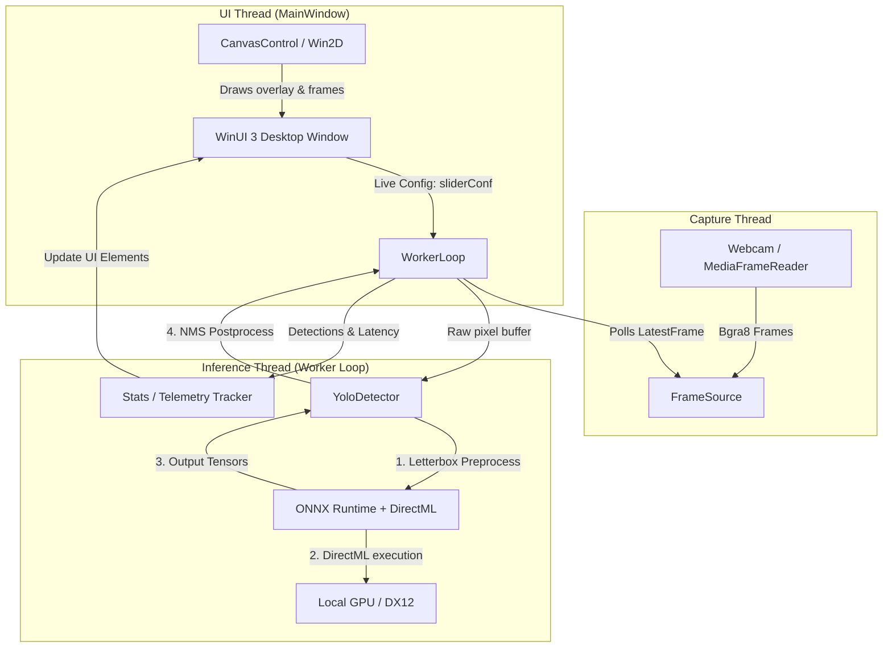

# 🖥️ VisionAI: Local Real-Time Object Detection

[](https://en.cppreference.com/w/cpp/compiler_support/17)
[](https://www.microsoft.com/windows)
[](https://learn.microsoft.com/windows/apps/winui/winui3/)
[](https://learn.microsoft.com/windows/ai/directml/dml-intro)
[](https://onnxruntime.ai/)

**VisionAI** is a high-performance, local real-time object detection dashboard built using **C++/WinRT**, **WinUI 3**, and **ONNX Runtime (DirectML)**. It runs state-of-the-art YOLOv8/YOLOv11 models with full hardware acceleration on any DirectX 12-capable GPU (NVIDIA, AMD, or Intel).

---

## ✨ Key Features

- **🚀 DirectML Hardware Acceleration**: Leverages ONNX Runtime's DirectML execution provider to execute models on the local GPU, providing high-speed inference without requiring CUDA.
- **🎨 Modern Fluent UI Dashboard**: A WinUI 3 desktop interface showcasing a real-time camera feed canvas, bounding box overlays, and rich diagnostic statistics (FPS, min/max/average latency, active hardware target).
- **⚡ Drop-Frame Thread Safety**: A dedicated camera acquisition thread (`FrameSource`) drops older frames if the processing thread is busy, ensuring the UI remains highly responsive with zero latency accumulation.
- **⚙️ Live Parameter Tuning**: Interactive slider controls allow real-time adjustment of model confidence thresholds (5% - 90%).
- **📦 WinRT-Free Core Engine**: The detector component (`YoloDetector`) is decoupled from Windows Runtime, allowing headless compilation and testing in console-only environments.
- **🔍 Headless Verification Harness**: An independent CLI project (`InferenceTest`) validates the shared detection engine, runs assertions on test assets, and reports performance details without firing up the UI.

---

## 🏗️ System Architecture

The application is structured into decoupled components to maximize performance and maintainability:



---

## 📂 Repository Structure

```
onnx/
├── VisionAI.sln              # Visual Studio 2022 Solution
├── VisionAI/                 # Main WinUI 3 Desktop App
│   ├── Capture/              # Webcam capture using MediaFrameReader
│   ├── Inference/            # decoupled YOLOv8/v11 ONNX DirectML engine
│   ├── Telemetry/            # Frames-per-second and latency aggregators
│   ├── Assets/               # Static icons, labels (coco.names), and models
│   └── MainWindow.xaml.cpp   # UI interaction and drawing layer (Win2D)
├── InferenceTest/            # Headless console harness (verifies detector)
├── test-assets/              # Test images (e.g., bus.jpg)
└── tools/                    # PyTorch YOLO -> ONNX export helper scripts
```

---

## 🛠️ Requirements & Dependencies

### System Requirements
- **OS**: Windows 10 (version 1809 / Build 17763 or higher) / Windows 11
- **Hardware**: DirectX 12 compatible GPU (NVIDIA, AMD, Intel)
- **Developer Tools**: Visual Studio 2022 (with *Desktop development with C++* workload)
- **Python**: Python 3.8+ (only needed for optional model export script)

### Package Dependencies (NuGet)
- `Microsoft.Windows.CppWinRT` (v2.0.250303.1)
- `Microsoft.WindowsAppSDK` (v1.8.260710003)
- `Microsoft.Graphics.Win2D` (v1.4.0)
- `Microsoft.ML.OnnxRuntime.DirectML` (v1.24.4)

---

## 🚀 Getting Started

### 1. Export the YOLOv8 ONNX Model
To build and run the app, you need a YOLOv8 ONNX model in the assets folder. Run the provided Python tool to download and export the weights:

```bash
# From the project root, download and export yolov8n.onnx
python tools/get_model.py
```
> [!NOTE]
> If you do not have CUDA setup in your python environment, use `python tools/get_model_cpu.py`. This script fetches a lightweight CPU-only PyTorch setup and exports the model directly into `VisionAI/Assets/yolov8n.onnx`.

### 2. Build & Launch in Visual Studio 2022
1. Open the solution file `VisionAI.sln` in **Visual Studio 2022**.
2. Set your Build Configuration to **Release** and your Platform to **x64**.
3. Right-click on the solution and select **Restore NuGet Packages**.
4. Set the startup project to **VisionAI**.
5. Press `F5` (or click **Start Debugging**) to compile and run.

### 3. Run Headless Console Verification
If you want to verify the model execution and latency without running the webcam UI:
1. Set the startup project to **InferenceTest** inside Visual Studio.
2. Run the project (`Ctrl+F5`).
3. It will load `test-assets/bus.jpg`, perform object detection using the DirectML pipeline, and print the outputs:
```text
Model : VisionAI/Assets/yolov8n.onnx
Image : test-assets/bus.jpg
Labels: 80 classes
Decoded image: 640x480 (3 ch)
Hardware target: DirectML - NVIDIA GeForce RTX 4080
  run 0: 12.34 ms, 4 detections
  run 1: 3.42 ms, 4 detections
  run 2: 3.38 ms, 4 detections
  run 3: 3.41 ms, 4 detections
  run 4: 3.39 ms, 4 detections

Detections (conf >= 0.25):
  person         0.87  [x=12 y=228 w=244 h=512]
  bus            0.82  [x=18 y=120 w=622 h=358]
  person         0.78  [x=212 y=230 w=234 h=508]
  person         0.34  [x=80 y=232 w=122 h=502]
```

---

## 📜 License
This project is open-source and available under the [MIT License](LICENSE).
YOLOv8 weights are licensed under the AGPL-3.0 License by [Ultralytics](https://github.com/ultralytics/ultralytics).
