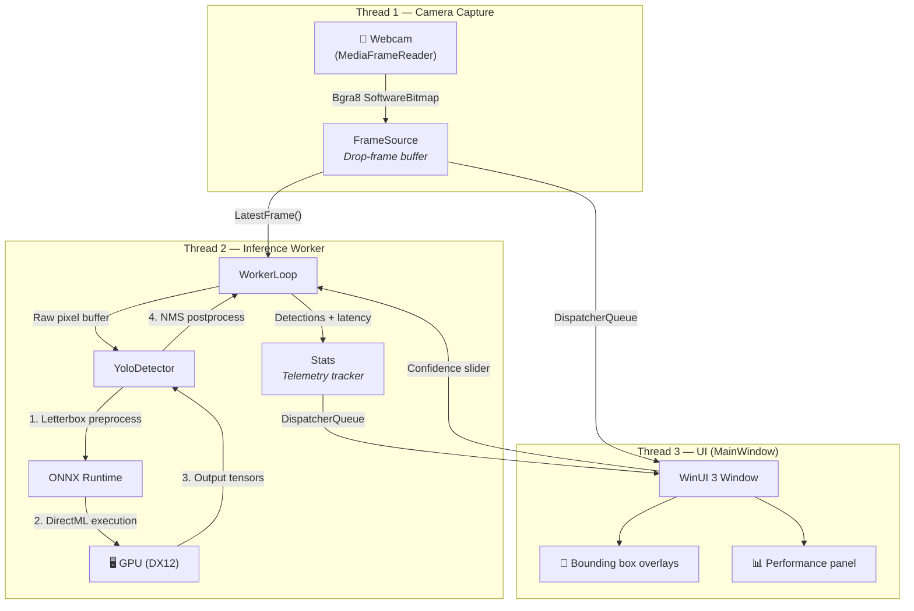

<](https://en.cppreference.com/w/cpp/compiler_support/17)
[](https://www.microsoft.com/windows)
[](https://learn.microsoft.com/windows/apps/winui/winui3/)
[](https://learn.microsoft.com/windows/ai/directml/dml-intro)
[](https://onnxruntime.ai/)
[](LICENSE)

A high-performance, privacy-first object detection dashboard built with **C++/WinRT**, **WinUI 3**, and **ONNX Runtime (DirectML)**. Runs YOLOv8/YOLOv11 models at hardware-accelerated speeds on any DirectX 12 GPU — **no CUDA required, no cloud, no data leaves your machine.**

[Getting Started](#-getting-started) · [Architecture](#-architecture) · [Documentation](#-documentation) · [Contributing](#contributing)

</div>

---

## 📋 Table of Contents

- [The Problem](#-the-problem)
- [The Solution](#-the-solution)
- [Key Features](#-key-features)
- [Architecture](#-architecture)
- [Repository Structure](#-repository-structure)
- [Getting Started](#-getting-started)
- [Documentation](#-documentation)
- [Troubleshooting](#-troubleshooting)
- [Contributing](#contributing)
- [License](#-license)
- [Acknowledgements](#-acknowledgements)

---

## ❓ The Problem

Real-time object detection is a foundational capability for security monitoring, accessibility tools, robotics, and countless other applications. However, deploying it on Windows today is frustratingly painful:

| Challenge | Status Quo |
|---|---|
| **Vendor lock-in** | Most solutions require an NVIDIA GPU with CUDA — leaving AMD and Intel users behind |
| **Cloud dependency** | Cloud vision APIs introduce latency, recurring costs, and **serious privacy concerns** when processing camera feeds |
| **Complex setup** | Python-based pipelines demand heavy environments (Conda, PyTorch, CUDA toolkit) just to run a single model |
| **Poor desktop integration** | Existing tools are web apps, terminal scripts, or Electron wrappers — none feel like a native Windows application |

## 💡 The Solution

**VisionAI** eliminates every one of these barriers:

- ✅ **Vendor-neutral GPU acceleration** — Runs on **any** DirectX 12 GPU (NVIDIA, AMD, Intel Arc) through DirectML
- ✅ **100% local** — All inference happens on-device. Zero network calls. Your camera feed never leaves your machine
- ✅ **Zero-dependency runtime** — Ships as a self-contained native executable. No Python, no CUDA toolkit, no frameworks to install
- ✅ **Native Windows experience** — Built with WinUI 3 and Fluent Design, VisionAI looks and feels like a first-party Windows app
- ✅ **Sub-5ms inference** — After the initial GPU warm-up, YOLOv8n runs in **~3–4 ms** on modern GPUs with the dedicated inference thread

---

## ✨ Key Features

### 🚀 DirectML Hardware Acceleration
Leverages ONNX Runtime's DirectML execution provider to execute models on the local GPU at maximum speed. If DirectML initialization fails, the engine **automatically falls back to CPU** so the app always works.

### 🎨 Modern Fluent UI Dashboard
A pure-code WinUI 3 desktop interface (no XAML markup) featuring a real-time camera feed canvas, color-coded bounding box overlays with class labels and confidence percentages, and a rich telemetry panel.

### ⚡ Drop-Frame Thread Safety
A dedicated camera acquisition thread (`FrameSource`) uses a lock-free drop-frame strategy — if the inference thread hasn't finished processing, stale frames are silently replaced. This guarantees **zero latency accumulation** and a permanently responsive UI.

### ⚙️ Live Parameter Tuning
An interactive slider lets you adjust the model's confidence threshold from **5% to 90%** in real time, powered by an `std::atomic<float>` for lock-free cross-thread communication.

### 📦 WinRT-Free Inference Core
The detector engine (`YoloDetector`) has **zero WinRT/XAML dependencies**, enabling headless compilation and testing in plain console environments. This clean separation makes the core reusable in CLI tools, services, or other C++ applications.

### 🔍 Headless Verification Harness
An independent CLI project (`InferenceTest`) validates the shared detection engine on static images, runs performance benchmarks, and prints detailed results — all without touching the UI stack.

---

## 🏗️ Architecture

VisionAI is structured as a **three-thread pipeline** with strictly decoupled components:



### Component Breakdown

| Component | Location | Responsibility |
|---|---|---|
| **`App`** | `VisionAI/App.{h,cpp}` | WinUI 3 application shell — creates and activates `MainWindow` |
| **`MainWindow`** | `VisionAI/MainWindow.{h,cpp}` | Builds the entire UI programmatically (no XAML), orchestrates the three-thread pipeline, renders bounding box overlays on a `Canvas`, and updates the telemetry panel |
| **`FrameSource`** | `VisionAI/Capture/FrameSource.{h,cpp}` | Wraps `MediaCapture` + `MediaFrameReader` for webcam access. Retains only the most recent frame (drop-frame strategy). Thread-safe via `std::mutex` + `std::atomic` |
| **`YoloDetector`** | `VisionAI/Inference/YoloDetector.{h,cpp}` | Core inference engine. Manages the ORT session, performs letterbox preprocessing, runs the model through DirectML, and applies postprocessing. **Zero WinRT dependencies** |
| **`Detection`** | `VisionAI/Inference/Detection.h` | Lightweight POD struct for a single detection result (bounding box + class ID + confidence score) |
| **`Nms`** | `VisionAI/Inference/Nms.{h,cpp}` | Class-aware greedy Non-Maximum Suppression using IoU thresholding |
| **`Stats`** | `VisionAI/Telemetry/Stats.{h,cpp}` | Thread-safe rolling telemetry — tracks FPS (sliding 1-second window) and inference latency (rolling average, min, max over last 30 runs) |
| **`InferenceTest`** | `InferenceTest/main.cpp` | Headless CLI harness — loads a JPEG via `stb_image`, runs 5 inference passes, and prints detections + latency |

### Inference Pipeline Detail

```
Input Frame (Bgra8 or Rgb8)
    │
    ▼
┌─────────────────────────────┐
│  1. Letterbox Preprocessing │  Nearest-neighbor resize to 640×640
│     (YoloDetector::Preprocess) │  with gray padding (114/255), then
│                             │  normalized to [0,1] planar CHW float32
└─────────────────────────────┘
    │
    ▼
┌─────────────────────────────┐
│  2. ONNX Runtime Session    │  Session::Run() on the DirectML EP
│     (DirectML → DX12 GPU)   │  Input:  [1, 3, 640, 640]  float32
│                             │  Output: [1, 84, 8400]      float32
└─────────────────────────────┘
    │
    ▼
┌─────────────────────────────┐
│  3. Postprocessing          │  Decode anchors → best-class selection
│     (YoloDetector::Postprocess) │  → un-letterbox to original coords
│                             │  → clamp to frame bounds
└─────────────────────────────┘
    │
    ▼
┌─────────────────────────────┐
│  4. Non-Maximum Suppression │  Class-aware greedy NMS with
│     (Nms::NonMaxSuppression)│  IoU threshold (default 0.45)
└─────────────────────────────┘
    │
    ▼
  std::vector<Detection>
```

---

## 📂 Repository Structure

```
onnx/
├── VisionAI.sln                  # Visual Studio 2022 solution (x64 + ARM64)
│
├── VisionAI/                     # Main WinUI 3 desktop application
│   ├── main.cpp                  # wWinMain entry point
│   ├── App.{h,cpp}              # WinUI 3 Application shell
│   ├── MainWindow.{h,cpp}      # Pure-code UI + pipeline orchestration
│   ├── pch.{h,cpp}             # Precompiled header (WinRT + WinUI + STL)
│   │
│   ├── Capture/
│   │   └── FrameSource.{h,cpp} # Webcam capture with drop-frame strategy
│   │
│   ├── Inference/
│   │   ├── Detection.h          # Detection struct + PixelFormat enum
│   │   ├── YoloDetector.{h,cpp} # ONNX Runtime inference (DirectML)
│   │   └── Nms.{h,cpp}         # Non-Maximum Suppression
│   │
│   ├── Telemetry/
│   │   └── Stats.{h,cpp}       # Rolling FPS & latency tracker
│   │
│   ├── Assets/
│   │   ├── coco.names           # COCO 80-class label file
│   │   └── yolov8n.onnx        # YOLOv8 Nano model (exported via tools/)
│   │
│   └── thirdparty/
│       ├── stb_image.h          # stb_image v2.x (header-only JPEG/PNG loader)
│       └── stb_image_impl.cpp   # Single compilation unit for stb_image
│
├── InferenceTest/                # Headless CLI verification harness
│   ├── main.cpp                 # Loads an image, runs inference, prints results
│   └── InferenceTest.vcxproj    # Console app project (reuses Inference/ sources)
│
├── test-assets/
│   └── bus.jpg                  # Test image for InferenceTest
│
└── tools/
    ├── get_model.py             # Export YOLOv8n to ONNX (requires CUDA PyTorch)
    └── get_model_cpu.py         # Export YOLOv8n to ONNX (CPU-only PyTorch)
```

---

## 🚀 Getting Started

### Prerequisites

| Requirement | Details |
|---|---|
| **OS** | Windows 10 (Build 17763+) or Windows 11 |
| **GPU** | Any DirectX 12 compatible GPU (NVIDIA, AMD, Intel) |
| **IDE** | Visual Studio 2022 with the **Desktop development with C++** workload |
| **Python** | Python 3.8+ *(only needed if you need to re-export the ONNX model)* |

### Step 1 — Export the YOLOv8 ONNX Model

The app needs a `yolov8n.onnx` model in `VisionAI/Assets/`. Use the provided helper scripts to download and export it:

```bash
# Option A: If you have CUDA-enabled PyTorch already installed
python tools/get_model.py

# Option B: CPU-only PyTorch (smaller download, no CUDA needed)
python tools/get_model_cpu.py
```

> [!NOTE]
> The CPU export script installs a lightweight CPU-only PyTorch wheel (~200 MB vs ~2 GB for CUDA) and exports the model directly into `VisionAI/Assets/yolov8n.onnx`.

> [!TIP]
> If the model file is already present in `VisionAI/Assets/yolov8n.onnx`, you can skip this step entirely.

### Step 2 — Build & Launch

1. Open `VisionAI.sln` in **Visual Studio 2022**
2. Set build configuration to **Release | x64** (or ARM64 on Arm devices)
3. Right-click the solution → **Restore NuGet Packages**
4. Set **VisionAI** as the startup project
5. Press **F5** to build and run

The application will:
- Initialize ONNX Runtime with the DirectML execution provider
- Auto-detect your GPU via DXGI enumeration
- Open your default webcam
- Begin real-time object detection

### Step 3 — Run the Headless Test (Optional)

To verify inference is working correctly without the camera UI:

1. Set **InferenceTest** as the startup project
2. Press **Ctrl+F5** (Start Without Debugging)
3. The harness loads `test-assets/bus.jpg`, runs 5 inference passes, and prints results:

```
Model : VisionAI/Assets/yolov8n.onnx
Image : test-assets/bus.jpg
Labels: 80 classes
Decoded image: 640x480 (3 ch)
Hardware target: DirectML - NVIDIA GeForce RTX 4080
  run 0: 12.34 ms, 4 detections
  run 1: 3.42 ms, 4 detections
  run 2: 3.38 ms, 4 detections
  run 3: 3.41 ms, 4 detections
  run 4: 3.39 ms, 4 detections

Detections (conf >= 0.25):
  person         0.87  [x=12 y=228 w=244 h=512]
  bus            0.82  [x=18 y=120 w=622 h=358]
  person         0.78  [x=212 y=230 w=234 h=508]
  person         0.34  [x=80 y=232 w=122 h=502]
```

> [!NOTE]
> The first inference run is always slower (GPU shader compilation / warm-up). Subsequent runs reflect steady-state performance.

---

## 📖 Documentation

### NuGet Package Dependencies

| Package | Version | Purpose |
|---|---|---|
| `Microsoft.Windows.CppWinRT` | 2.0.250303.1 | C++/WinRT projection headers |
| `Microsoft.WindowsAppSDK` | 1.8.260710003 | WinUI 3 controls, windowing, and Fluent Design |
| `Microsoft.ML.OnnxRuntime.DirectML` | 1.24.4 | ONNX Runtime with DirectML execution provider |

> [!IMPORTANT]
> The Windows App SDK bundles its own older ONNX Runtime (1.23). The build system includes a custom MSBuild target (`ForceOnnxRuntimeVersion`) that overwrites those DLLs with the 1.24 build to prevent version conflicts. Additionally, `onnxruntime.dll` is **delay-loaded** so the correct app-local version is resolved at startup.

### Build Configurations

| Configuration | Platform | Notes |
|---|---|---|
| Debug \| x64 | x64 | Full debug symbols, no optimizations |
| Release \| x64 | x64 | Full optimizations (`/O2`), whole-program optimization |
| Debug \| ARM64 | ARM64 | For Windows on Arm devices |
| Release \| ARM64 | ARM64 | Optimized ARM64 build |

### Key Design Decisions

#### Pure-Code WinUI 3 (No XAML)
The entire UI is constructed programmatically in `MainWindow::BuildUi()`. This eliminates the XAML markup compiler, reduces build complexity, and gives full C++ control over the widget tree.

#### Self-Contained / Unpackaged Deployment
The app uses `<WindowsPackageType>None</WindowsPackageType>` and `<WindowsAppSDKSelfContained>true</WindowsAppSDKSelfContained>`, meaning all WinUI 3 runtime DLLs are copied next to the executable. No MSIX packaging, no Windows App Runtime installer, no Store certification required.

#### Automatic DirectML-to-CPU Fallback
If the DirectML execution provider fails to initialize (e.g., no DX12 GPU, driver issues), `YoloDetector::Load()` automatically retries with CPU-only inference. The app always works.

#### Thread Architecture
- **Capture thread**: Owned by `MediaFrameReader` — fires callbacks asynchronously on arrival of each webcam frame
- **Inference thread**: A dedicated `std::thread` running `WorkerLoop()` — polls `FrameSource` for new frames and runs the detector
- **UI thread**: The WinUI 3 `DispatcherQueue` thread — receives render callbacks to update the image, overlays, and telemetry panel

Cross-thread communication uses `std::atomic` for scalars (confidence threshold, frame IDs, render flags) and `std::mutex` for shared data (detection vectors, frame dimensions).

### Model Compatibility

VisionAI supports any ONNX model with the **YOLOv8/YOLOv11 output layout**:

- **Input**: `[1, 3, 640, 640]` float32 (RGB, normalized to [0, 1])
- **Output**: `[1, num_attributes, num_anchors]` float32 where `num_attributes = 4 + num_classes`

The default model is `yolov8n.onnx` (YOLOv8 Nano, 80 COCO classes, ~12 MB). You can swap in larger variants (yolov8s, yolov8m) or custom-trained models by replacing the `.onnx` file and updating `coco.names` if class labels differ.

### Command-Line Arguments (InferenceTest)

```
InferenceTest.exe [model_path] [image_path] [labels_path]
```

| Argument | Default | Description |
|---|---|---|
| `model_path` | `VisionAI/Assets/yolov8n.onnx` | Path to the ONNX model file |
| `image_path` | `test-assets/bus.jpg` | Path to the input image (JPEG/PNG) |
| `labels_path` | `VisionAI/Assets/coco.names` | Path to the class labels file |

---

## 🔧 Troubleshooting

<details>
<summary><strong>Build error: NuGet packages not restored</strong></summary>

Right-click the solution in Visual Studio → **Restore NuGet Packages**. If that fails, delete the `packages/` directory and the `build/` directory, then retry.
</details>

<details>
<summary><strong>Runtime error: "Model load failed"</strong></summary>

Ensure `yolov8n.onnx` exists in `VisionAI/Assets/`. Run `python tools/get_model_cpu.py` from the repository root to export the model.
</details>

<details>
<summary><strong>Camera not detected / "Camera error"</strong></summary>

- Ensure a webcam is connected and not in use by another application
- Check that camera access is enabled in **Windows Settings → Privacy → Camera**
- Try unplugging and reconnecting the camera
</details>

<details>
<summary><strong>Low FPS / Poor performance</strong></summary>

- Verify DirectML is active by checking the **HARDWARE TARGET** label in the telemetry panel (it should show your GPU name, e.g., "DirectML - NVIDIA GeForce RTX 4060")
- If it shows "CPU", your GPU driver may not support DirectX 12. Update your GPU drivers
- Close other GPU-intensive applications
</details>

<details>
<summary><strong>ONNX Runtime DLL version conflict</strong></summary>

The Windows App SDK bundles an older ORT DLL. The build system's `ForceOnnxRuntimeVersion` target should handle this automatically. If you still see issues, verify that `onnxruntime.dll` in your output directory (`build/x64/Release/VisionAI/`) is version 1.24.4.
</details>

---

## Contributing

Contributions are welcome! Please read the [Contributing Guide](CONTRIBUTING.md) for details on our development workflow, coding standards, and how to submit pull requests.

**Quick overview:**

1. Fork the repository
2. Create a feature branch (`git checkout -b feature/my-feature`)
3. Commit your changes (`git commit -m "Add my feature"`)
4. Push to your branch (`git push origin feature/my-feature`)
5. Open a Pull Request

> [!TIP]
> Check the [Issues](https://github.com/martian7777/onnx/issues) page for open tasks and feature requests. Issues labeled `good first issue` are a great starting point.

---

## 📜 License

This project is open-source and available under the **[MIT License](LICENSE)**.

```
MIT License — Copyright (c) 2025 martian7777

Permission is hereby granted, free of charge, to any person obtaining a copy
of this software and associated documentation files, to deal in the Software
without restriction, including without limitation the rights to use, copy,
modify, merge, publish, distribute, sublicense, and/or sell copies.
```

### Third-Party Licenses

| Component | License | Notes |
|---|---|---|
| [ONNX Runtime](https://github.com/microsoft/onnxruntime) | MIT | Microsoft's cross-platform ML inference engine |
| [DirectML](https://github.com/microsoft/DirectML) | MIT | Microsoft's hardware-accelerated ML on DirectX 12 |
| [YOLOv8 Weights](https://github.com/ultralytics/ultralytics) | AGPL-3.0 | Ultralytics model weights — see their license for redistribution terms |
| [stb_image](https://github.com/nothings/stb) | MIT / Public Domain | Single-header JPEG/PNG image loader |
| [Windows App SDK](https://github.com/microsoft/WindowsAppSDK) | MIT | Microsoft's WinUI 3 framework |

---

## 🙏 Acknowledgements

- **[Ultralytics](https://github.com/ultralytics/ultralytics)** for the YOLOv8 architecture and pretrained weights
- **[Microsoft ONNX Runtime](https://onnxruntime.ai/)** for the blazing-fast cross-platform inference engine
- **[Microsoft DirectML](https://learn.microsoft.com/windows/ai/directml/dml-intro)** for vendor-neutral GPU acceleration
- **[Sean Barrett (nothings)](https://github.com/nothings/stb)** for the legendary `stb_image` library

---

<div align="center">
<sub>Built with ❤️ for the Windows AI ecosystem</sub>
</div>
]]>
